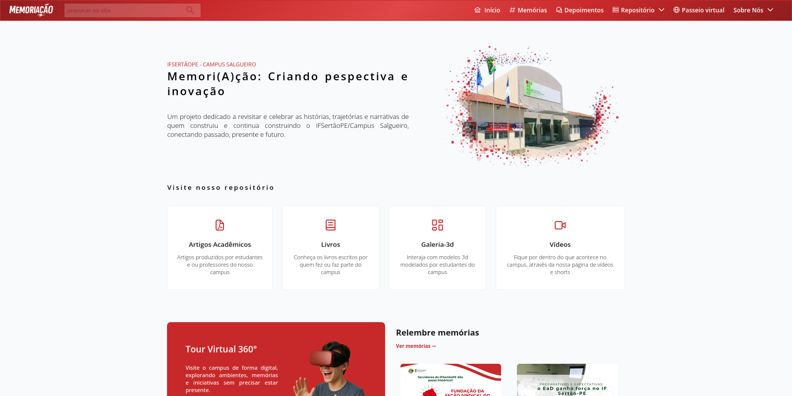

## 🏛️ MemoriAção: O Museu Virtual do IFSertãoPE
 

  

---

O **MemoriAção** é um espaço digital dedicado à preservação e celebração da história do **Campus Salgueiro**. Mais do que um repositório de arquivos, este site é uma plataforma interativa que reconecta a comunidade académica com sua própria trajetória, transformando memórias institucionais numa experiência viva e acessível a todos.

## ✨ O que é o projeto?

O site funciona como um **museu virtual interativo**. Foi idealizado para organizar e dar visibilidade a tudo o que foi construído ao longo dos anos no campus: desde produções científicas e projetos de extensão até aos registos culturais e sociais que moldaram a nossa identidade.

Aqui, o visitante não apenas lê sobre o passado; ele navega por uma jornada que inclui:

* **Nossa História:** Um registo cronológico dos marcos que definiram o Campus Salgueiro ao longo dos últimos 15 anos.
* **Produção Académica:** Uma vitrine para o conhecimento gerado por alunos e servidores.
* **Memória Coletiva:** Fotos, vídeos e relatos que mantêm viva a cultura do Sertão central.

---

## 🚀 Uma Nova Experiência Digital

Este site representa uma evolução significativa na forma como compartilhamos nossa história. Estamos a migrar de um formato de blogue estático para uma plataforma moderna, fluida e visualmente rica.

* **Onde Estávamos:** [memoriacao.wordpress.com](https://www.memoriacao.wordpress.com) (O nosso antigo acervo)
* **Onde Estamos Agora:** [memoriacao.github.io/site](https://memoriacao.onrender.com/#/) (O novo museu interativo)

A nova interface foi desenhada para ser intuitiva, permitindo que qualquer pessoa encontre informações e se sinta parte desta trajetória institucional.

---

## 📸 Ajude a Construir o Acervo

Um museu de memórias está em constante crescimento e a sua participação é fundamental. Se possui registos, fotos, documentos ou histórias que fazem parte da trajetória do **IFSertãoPE – Campus Salgueiro**, pode contribuir para o projeto.

**Como enviar novas memórias:**

* **O que pode enviar:** Fotografias de eventos, registos de projetos de pesquisa, documentos históricos ou depoimentos em texto/vídeo.
* **Processo de Curadoria:** Todo o material enviado passa por uma curadoria pedagógica para ser catalogado e exibido na plataforma.
* **Contacto:** [Inserir E-mail ou Link de Formulário]

---

## 🎯 Por que o MemoriAção existe?

Nossa missão é garantir que nenhuma conquista ou registo histórico se perca com o tempo. Através desta plataforma, servimos como:

1. **Fonte de Pesquisa:** Um acervo organizado para estudantes e investigadores.
2. **Registo Histórico:** A guarda oficial da memória institucional do campus.
3. **Ferramenta Educativa:** Um suporte para que as novas gerações compreendam o impacto da instituição na região.

---

> "Preservar a memória não é apenas olhar para o passado, é dar raízes ao futuro do Campus Salgueiro."
